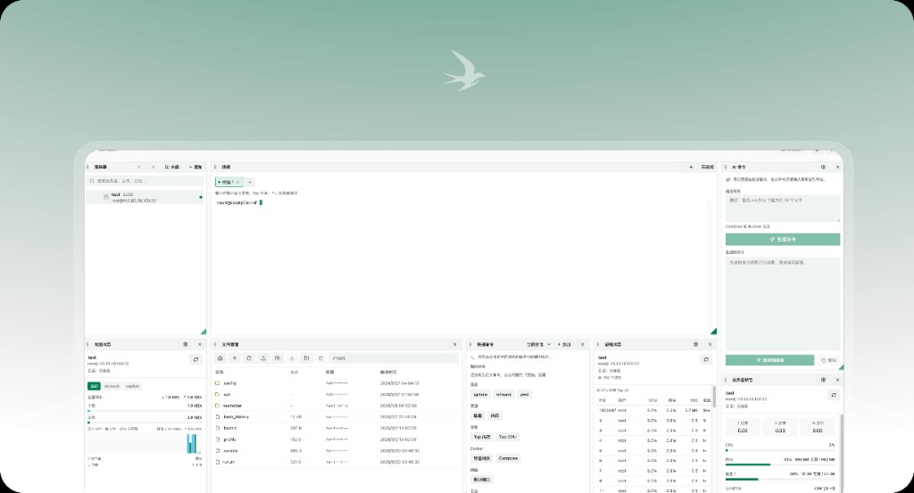

  <picture>
    <source media="(prefers-color-scheme: dark)" srcset="web/public/logo-dark.png" />
    <source media="(prefers-color-scheme: light)" srcset="web/public/logo-light.png" />
    
  </picture>

<h1 align="center">ternssh</h1>

  SSH workspace on Cloudflare 
  Draggable dashboard · Terminal · SFTP · Status monitoring

  <a href="LICENSE">GPL-3.0-or-later</a>
  ·
  <a href="README.md">中文</a>

  

  <picture>
    <source media="(prefers-color-scheme: dark)" srcset="docs/preview-dark.png" />
    <source media="(prefers-color-scheme: light)" srcset="docs/preview-light.png" />
    
  </picture>

---

**ternssh** is an SSH management tool that runs on Cloudflare Edge. Full documentation: **[Docs](https://ternssh.com/docs/home)**.

## Deployment

See the [deployment guide](https://ternssh.com/docs/deployment) for details.
